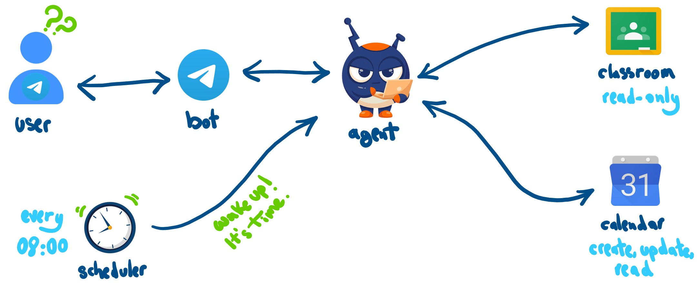
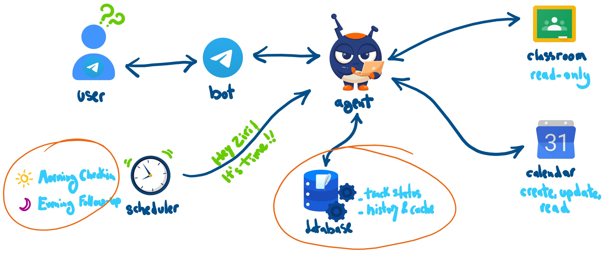
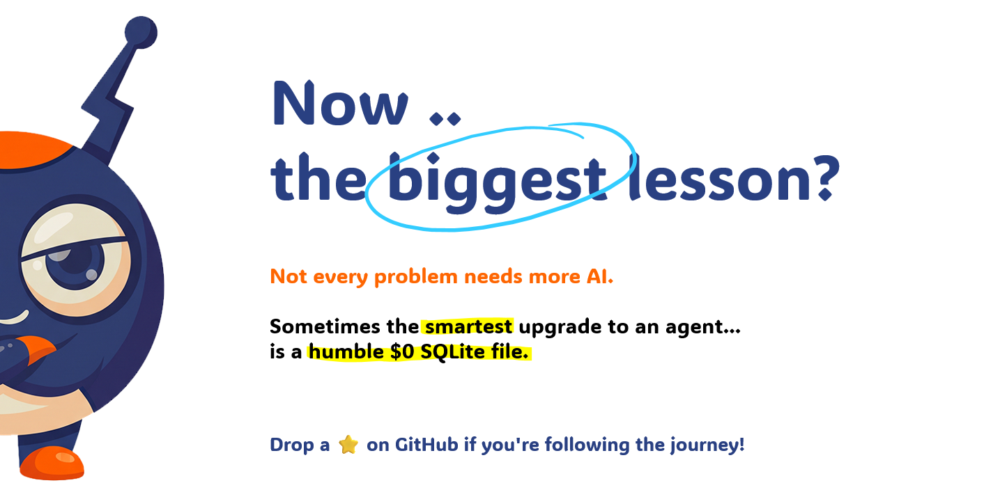

# 🤖 Ziri — Personal AI Assistant for Students

**An autonomous, proactive personal AI assistant built with Google ADK, Gemini 3.5 Flash-Lite, Telegram, and SQLite to tame the chaotic side of student life.**

---

## 📌 Overview

 

Balancing university life is notoriously chaotic. Assignment deadlines hide inside Google Classroom, study sessions and club meetings are scattered across Google Calendar, and traditional to-do apps rely on brittle manual data entry.

**Ziri** is a self-hosted personal AI assistant built to bridge this gap. Rather than acting as a passive chatbot that waits for queries, Ziri is an **accountability partner**:
* 🌅 **Morning Briefings (09:00):** Delivers a clean, synthesized breakdown of today's schedule alongside upcoming coursework deadlines directly to Telegram.
* 🌙 **Evening Follow-up / "Suivi" (21:00):** Checks in to see what actually got accomplished, helping reschedule pending items and holding you accountable.
* 💬 **Conversational Command:** Natural language event scheduling, task tracking, and coursework lookups with strict confirmation gates.

> 💡 **Build in Public Status:** Currently at **V3** (Long-Term Memory). Plug-and-play public deployment and multi-platform packaging are scheduled for **V7**.

---

## 🚀 The Evolution: V1 ➔ V2 ➔ V3

Ziri is built incrementally in strict version stages—shipping, validating, and stress-testing each layer before moving to the next.

| Version | Focus | Core Capability | Memory State |
| :--- | :--- | :--- | :--- |
| **V1** | **Prove the Loop** | Telegram Bot + Google Calendar API + Morning schedule briefing | Stateless |
| **V2** | **Coursework Awareness** | Google Classroom API integration for live assignments & due dates | Stateless |
| **V3** | **Long-Term Memory** *(Current)* | SQLite persistence for planned-vs-done state + Evening accountability check-ins | **Stateful (SQLite)** |
| **V4** | **Email Integration** | Gmail read-only triage (flag professor replies) | *Upcoming* |

---

## 🏛️ System Architecture: V2 vs. V3

The biggest leap in the project occurred between **V2** and **V3**. Here is how the system evolved under the hood:

### 1. How V2 Worked (Stateless Execution)

In V2, the assistant was purely reactive. Every user question required fetching live data from Google APIs on the fly:

  

#### The V2 Bottleneck:
* **"Goldfish Memory":** Without persistence across sessions, the bot had no memory of yesterday's tasks or what had already been completed.
* **Repetitive API Overhead:** If the user asked three questions in five minutes, the bot called Calendar and Classroom APIs every single time, driving up latency and token consumption.

---

### 2. How V3 Works (Stateful Architecture with SQLite)

In V3, Ziri gained a persistent local brain using SQLite to cache items, track task states across bot restarts, and power evening check-ins:

  

#### Key V3 Upgrades:
* **Composite State Tracking:** Composite primary keys `(source_type, source_id)` decouple Google Calendar events from Classroom assignments cleanly in the database schema.
* **Three-State Task Lifecycle:** Tracks tasks through `NOT_STARTED` ➔ `IN_PROGRESS` ➔ `DONE`.
* **Historical Queries:** The assistant can answer questions like *"What did I finish this week?"* instantly using deterministic SQL queries rather than re-computing from external APIs.
* **Dual Check-in Pipeline:** Morning plan dispatch + Evening accountability follow-up.

---

## 🧠 Key Engineering Decisions & Trade-Offs

  

### 1. Pragmatic AI: Why a $0 SQLite File Beat Vector Stores
When adding "long-term memory" to an agent, the modern knee-jerk reaction is to introduce a heavy vector database (Pinecone, Chroma) or complex semantic embeddings. 

**Why we chose SQLite instead:**
* Task state tracking (`DONE`, `NOT_STARTED`, due dates, calendar IDs) is an **exact relational problem**, not a semantic search problem.
* Zero external infrastructure dependencies, zero dollar cost, sub-millisecond local latency, and rock-solid ACID transactions.
* **Takeaway:** *Not every problem needs more AI. Often the smartest upgrade to an agent is a humble, robust local database.*

### 2. Safety First: Deterministic Confirmation Gates
LLMs should never execute destructive or external write actions silently:
* When asked to create or reschedule an event, Ziri determines the parameters, drafts the proposal, and **explicitly asks the user for confirmation**.
* The tool call `create_calendar_event` or `update_calendar_event` is blocked until the user replies with an explicit affirmative (`"yes"`, `"confirm"`, `"go ahead"`).

### 3. Concurrency & UX Latency Optimization
* **Parallel API Execution:** Classroom coursework fetching was refactored from serial loops to concurrent execution using Python's `concurrent.futures.ThreadPoolExecutor` (up to 8 workers), slashing fetch latency from ~4.5s to under 1s.
* **TTL Caching:** Added in-memory TTL caching with automatic invalidation upon write actions to keep rapid multi-turn chats snappy.
* **Non-blocking Telegram UX:** Implemented a background `keep_typing` coroutine and intermediate contextual notices (*"Looking at your calendar right now... 🔍"*) so the user always has immediate feedback during slower network calls.

---

## 🗺️ Project Roadmap

- [x] **V1 — Prove the Loop:** Telegram bot, Google Calendar API, automated morning schedule briefing. *(Shipped)*
- [x] **V2 — Coursework Awareness:** Read-only Google Classroom API integration for live assignments. *(Shipped)*
- [x] **V3 — Long-Term Memory:** SQLite task persistence, historical queries, evening follow-up check-in. *(Shipped)*
- [ ] **V4 — Email Integration (Read-Only):** Gmail read access to flag urgent professor emails and announcements.
- [ ] **V5 — Email Drafting:** Context-aware draft generation with a strict Telegram approval gate.
- [ ] **V6 — Weekly Planning Session:** Structured Sunday interactive planning flow pulling from Calendar, Classroom, and execution history.
- [ ] **V7 — Always-On Cloud Deployment:** Production containerization (Docker) and 24/7 cloud VM hosting.

---

## 🛠️ Tech Stack

| Layer | Technology | Role |
| :--- | :--- | :--- |
| **Agent Framework** | [Google ADK](https://github.com/google/agent-development-kit) (v2.7.0) | Agent orchestration, tool bindings, runner lifecycle |
| **Foundation Model** | Gemini 3.5 Flash-Lite | Fast, cost-efficient reasoning and conversational interface |
| **User Interface** | [python-telegram-bot](https://python-telegram-bot.org/) (v22.8) | Telegram webhook/polling, streaming updates, slash commands |
| **Persistence** | SQLite3 (`storage.py`) | Local relational storage for task states, history, and cache |
| **APIs & Auth** | Google Calendar API, Google Classroom API | OAuth2 flow (`google-auth-oauthlib`), coursework and event sync |
| **Scheduling** | Python `scheduler.py` | Local background process triggering daily morning and evening runs |

---

## 👤 Author & Journey

Built with ❤️ by **Astrowalid** as part of my journey in **AI & Data Science**.

* 💼 **LinkedIn:** [Walid IDBENNACER](https://www.linkedin.com/in/walid-idbennacer-65b42a215/)
* 🐙 **GitHub:** [@Astrowalid](https://github.com/Astrowalid)
* ⭐ **Enjoying the project?** Drop a star on this repository to follow along with the V4 build!

  